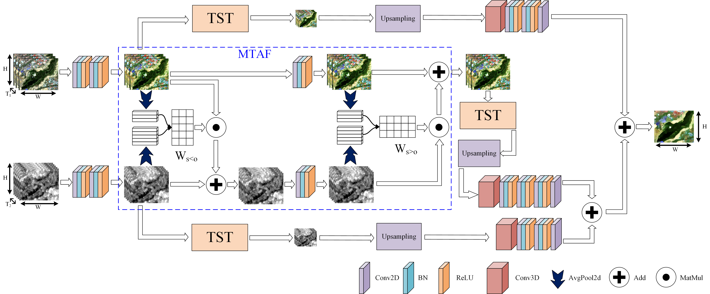

# Semantic segmentation of land cover in urban areas by fusing multi-source satellite image time series  ([paper](https://ieeexplore.ieee.org/document/10308638))

## Dataset
```python
  data
  ├── dataset
      ├── Ili-Patch16
          ├── 4
              ├── test.csv
              ├── train.csv
              ├── val.csv
          ├── gt (Label)
          ├── p (Optic patch)
          ├── s (SAR patch)
  ```

## Model


## Usage
```
 train：python main.py --num_workers 8 --root_dir data/dataset/Ili-Patch16 --order 5 --batch_size 4 --lr 0.0001 --epochs 100 --net_G MTAF_TST --last_epoch -1 --checkpoint work/models/P_S/2021-10-06T18:25:41.pk --do train --T_P 40 --T_S 46 --in_channels_P 4 --in_channels_S 2 --patch_size 16 --classes 6
 test：python main.py --num_workers 8 --root_dir data/dataset/Ili-Patch16 --order 5 --batch_size 4 --lr 0.0001 --epochs 100 --net_G MTAF_TST --last_epoch -1 --checkpoint work/models/utae/Ili-Patch16/5/2022-12-28T06-57-52.pkl --do test --T_P 40 --T_S 46 --in_channels_P 4 --in_channels_S 2 --patch_size 16 --classes 6
 ```

## Citation
```
@ARTICLE{10308638,
  author={Yan, Jining and Liu, Jingwei and Liang, Dong and Wang, Yi and Li, Jun and Wang, Lizhe},
  journal={IEEE Transactions on Geoscience and Remote Sensing}, 
  title={Semantic Segmentation of Land Cover in Urban Areas by Fusing Multisource Satellite Image Time Series}, 
  year={2023},
  volume={61},
  number={},
  pages={1-15},
  doi={10.1109/TGRS.2023.3329709}}
```

